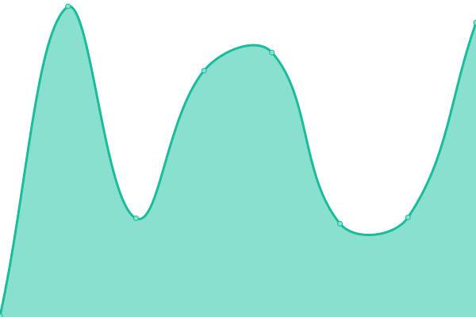
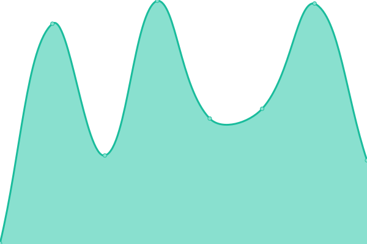

# [📈 Live Status](https://Ranwalk.github.io/ranwalk-uptime): <!--live status--> **🟩 All systems operational**

This repository contains the open-source uptime monitor and status page for [Ranwalk](https://Ranwalk.github.io/ranwalk-uptime), powered by [Upptime](https://github.com/upptime/upptime).

With [Upptime](https://upptime.js.org), you can get your own unlimited and free uptime monitor and status page, powered entirely by a GitHub repository. We use [Issues](https://github.com/Ranwalk/ranwalk-uptime/issues) as incident reports, [Actions](https://github.com/Ranwalk/ranwalk-uptime/actions) as uptime monitors, and [Pages](https://Ranwalk.github.io/ranwalk-uptime) for the status page.

<!--start: status pages-->
<!-- This summary is generated by Upptime (https://github.com/upptime/upptime) -->
<!-- Do not edit this manually, your changes will be overwritten -->
<!-- prettier-ignore -->
| URL | Status | History | Response Time | Uptime |
| --- | ------ | ------- | ------------- | ------ |
|  [Ranwalk main](https://app.ranwalk.com) | 🟩 Up | [ranwalk-main.yml](https://github.com/TeraBlitz/ranwalk-uptime/commits/HEAD/history/ranwalk-main.yml) | 

 254ms
     
 | 

<a href="https://TeraBlitz.github.io/ranwalk-uptime/history/ranwalk-main">99.74%</a>
    

|  [Luna](https://luna.ranwalk.com/accounts/login/?next=/chart/deep-discount/) | 🟩 Up | [luna.yml](https://github.com/TeraBlitz/ranwalk-uptime/commits/HEAD/history/luna.yml) | 

 266ms
     
 | 

<a href="https://TeraBlitz.github.io/ranwalk-uptime/history/luna">99.74%</a>
    

<!--end: status pages-->

[**Visit our status website →**](https://Ranwalk.github.io/ranwalk-uptime)

## 📄 License

- Powered by: [Upptime](https://github.com/upptime/upptime)
- Code: [MIT](./LICENSE) © [Anand Chowdhary](https://anandchowdhary.com), supported by [Pabio](https://pabio.com)
- Data in the `./history` directory: [Open Database License](https://opendatacommons.org/licenses/odbl/1-0/)
